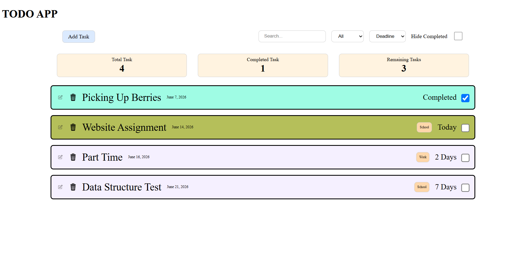
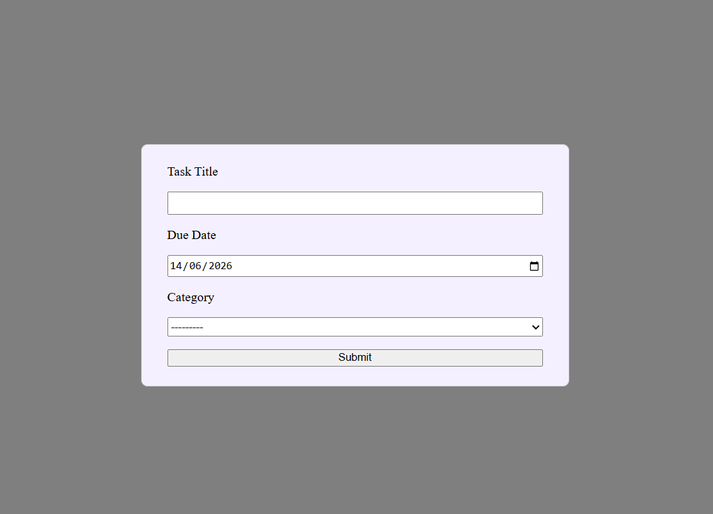

# TODO App

## Overview
Task management app that's build with Django and HTMX.
User can create, update, delete, search and categorize the task in a responsive design

## Features
- Create tasks
- Update tasks
- Delete tasks
- Sort task
- Search task
- Mark task as complete
- Hide completed task
- Modal form
- Task deadline overview
- Task status card

## Tech Stack
- Python
- Django
- HTML
- HTMX
- CSS

# ScreenShots

### Task List


### Modal Form


## Installation
```bash
git clone https://github.com/madayuki1/django_todo.git
cd django-todo
pip install -r requirements.txt
python manage.py migrate
python manage.py runserver
```

## Challenges & Lesson Learned
- Learned Django classed based view
- Impletemented category filtering
- Impletemented variety of sorting 
- Integrating HTMX with Django
- Reuseable Modal

## Future Improvements
- User Authentication
- Better Frondend framework
- More features in general